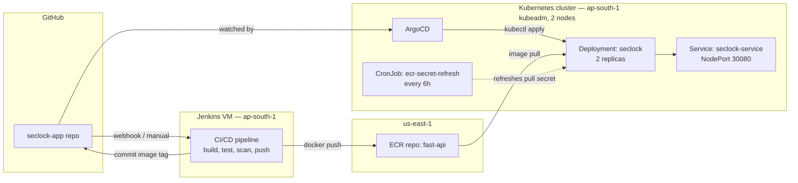
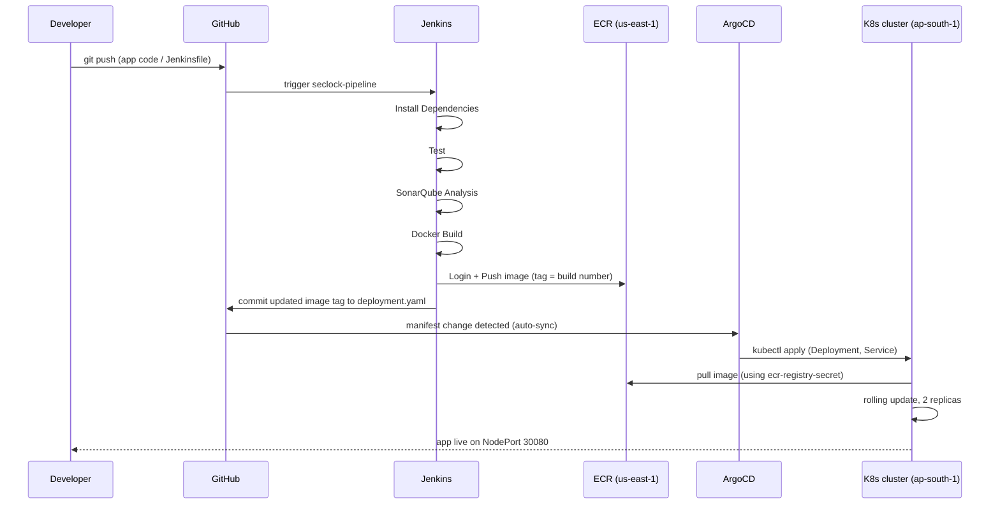
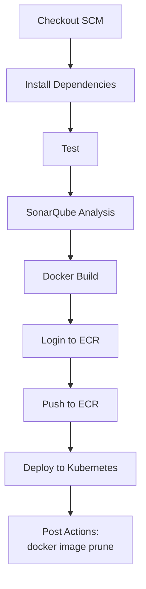
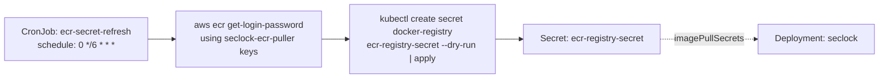

# Seclock — Deployment & Infrastructure

This README documents the **deployment side** of the Seclock project: containerization, CI/CD, Kubernetes cluster setup, and GitOps delivery. The application itself (FastAPI backend, OCR, cryptography, frontend) was built by the development team — this covers everything from source code to a running, self-healing deployment in production.

## Table of contents

- [Architecture overview](#architecture-overview)
- [Deployment flow](#deployment-flow)
- [Infrastructure](#infrastructure)
- [CI/CD pipeline](#cicd-pipeline)
- [Kubernetes cluster](#kubernetes-cluster)
- [ECR cross-region pull secret](#ecr-cross-region-pull-secret)
- [GitOps with ArgoCD](#gitops-with-argocd)
- [Repository layout](#repository-layout)
- [Setup from scratch](#setup-from-scratch)
- [Issues hit and fixed](#issues-hit-and-fixed)

## Architecture overview

Two AWS regions are involved intentionally: the ECR repository already existed in **us-east-1**, while the Jenkins host and Kubernetes cluster run in **ap-south-1**.



## Deployment flow

End-to-end sequence from a code push to the app running in the cluster:



## Infrastructure

| Resource | Value |
|---|---|
| VPC | `vpc-01b089fbf701ab9e1` |
| Subnet | `subnet-00c7e7a2bd17194fc` |
| Security group | `sg-0818cf6d19b0c9290` (`k8s-cluster-sg`) |
| Jenkins VM | ap-south-1, hosts Jenkins, Docker, `kubectl`, AWS CLI |
| K8s control plane | ap-south-1, kubeadm, `172.31.6.136` (private) |
| K8s worker | ap-south-1, kubeadm, `172.31.2.152` (private) |
| ECR repo | `fast-api`, us-east-1 |
| IAM user (cluster pull) | `seclock-ecr-puller` — ECR pull-only policy |
| IAM user (Jenkins push) | `jenkins-ecr-pusher` — ECR push/pull policy |

Security group ingress: 6443, 2379-2380, 10250-10252, 8285/8472 UDP, 30000-32767 (all self-referencing within the SG for node-to-node traffic), plus 22 (SSH) and 8080 (Jenkins UI) opened to specific admin IPs.

## CI/CD pipeline

Jenkins declarative pipeline (`Jenkinsfile`), triggered on push to `main`:



**Stage details:**
- **Install Dependencies / Test** — installs the app's Python dependencies and runs the test suite before anything is built into an image.
- **SonarQube Analysis** — static code analysis gate; a failing quality gate stops the pipeline before a Docker image is ever built.
- **Docker Build** — multi-stage build (builder stage compiles dependencies, runtime stage is a slim non-root image), healthcheck against `/api/state`.
- **Login to ECR** — authenticates using a dedicated `jenkins-ecr-pusher` IAM user (static keys stored as a Jenkins credential, not in source — the Jenkins VM has no IAM instance profile attached).
- **Push to ECR** — tags the image with the Jenkins build number and `latest`, pushes both.
- **Deploy to Kubernetes** — substitutes the built image URI into `k8s/deployment.yaml` and runs `kubectl apply` + `kubectl rollout status`, using the `seclock-kubeconfig` Jenkins credential (a copy of the cluster's admin kubeconfig).

**Jenkins credentials used:**
| ID | Type | Purpose |
|---|---|---|
| `seclock-kubeconfig` | Secret file | Cluster admin kubeconfig, for `kubectl` calls |
| `aws-ecr-creds` | Username/password | `jenkins-ecr-pusher` access key/secret, for ECR auth |

## Kubernetes cluster

Built with **kubeadm** (self-managed, not EKS) on plain EC2 instances:

- Ubuntu 22.04, Kubernetes v1.30.14, `containerd` runtime.
- Flannel CNI, pod CIDR `10.244.0.0/16`.
- 1 control-plane node + 1 worker node, joined via `kubeadm join`.
- Deployment `seclock`: 2 replicas, rolling update strategy, resource requests/limits, readiness/liveness probes against `/api/state`.
- Service `seclock-service`: `NodePort` (no cloud load balancer available on a bare kubeadm cluster).

## ECR cross-region pull secret

Because the cluster is self-managed (no IRSA/instance-role integration like EKS provides), and ECR auth tokens expire every 12 hours, a dedicated mechanism keeps the cluster able to pull images:



- RBAC: a dedicated ServiceAccount, Role, and RoleBinding (`ecr-secret-refresher`) grant `get/create/update/patch/delete` on `secrets` — `patch` is required because `kubectl apply` on an existing secret issues a patch, not a create.
- AWS credentials for the refresh job come from a Kubernetes Secret (`aws-static-creds`), not hardcoded in the CronJob manifest.

## GitOps with ArgoCD

ArgoCD watches the deployment manifests in the repository and reconciles the live cluster state against them — Jenkins no longer runs `kubectl apply` directly against the cluster; it updates the manifest in git, and ArgoCD picks up the change automatically (auto-sync enabled).

**Why this matters:** Having both Jenkins and ArgoCD issue `kubectl apply` independently would cause the two to fight over the same resources. The pattern used here is: **Jenkins builds and pushes the image, then updates the manifest in git** — ArgoCD is the only thing that actually applies changes to the cluster.

ArgoCD application tree for `seclock-pipeline` includes: `seclock` (Deployment), `seclock-service` (Service), and the `ecr-secret-refresh` CronJob with its ServiceAccount/Role/RoleBinding — all tracked and health-checked as one application.

## Repository layout

```
seclock-app/
├── Dockerfile                          # multi-stage build, non-root runtime
├── .dockerignore
├── Jenkinsfile                         # CI/CD pipeline definition
├── k8s/
│   ├── deployment.yaml                 # Deployment + Service
│   └── ecr-secret-refresh-cronjob.yaml # ServiceAccount, Role, RoleBinding, CronJob
├── main.py, crypto_engine.py, ...      # application source
└── static/                             # frontend assets
```

## Setup from scratch

High-level order, if reproducing this from nothing (empty AWS account, source code only):

1. Provision a VPC/subnet/security group with the ingress rules listed above.
2. Launch 2 EC2 instances for the cluster; install `containerd`, `kubeadm`, `kubelet`, `kubectl` on both.
3. `kubeadm init` on one node, install Flannel, `kubeadm join` the other as a worker.
4. Create IAM users/policies for ECR pull (cluster) and ECR push (Jenkins).
5. Create the initial `ecr-registry-secret` and apply the `ecr-secret-refresh-cronjob.yaml`.
6. Install Jenkins + Docker + `kubectl` + AWS CLI on a separate VM; add it to the `docker` group.
7. Add the `seclock-kubeconfig` and `aws-ecr-creds` Jenkins credentials.
8. Create the `seclock-pipeline` job (Pipeline script from SCM, pointed at this repo's `Jenkinsfile`).
9. Install ArgoCD in the cluster, create an Application pointed at this repo's `k8s/` manifests, enable auto-sync.
10. Push to `main` — Jenkins builds/tests/scans/pushes the image and updates the manifest; ArgoCD syncs it to the cluster.

## Issues hit and fixed

- **Security group source IP mismatch** — an SSH rule referenced the Jenkins VM's public IP, but intra-VPC traffic uses private IPs; `scp`/`ssh` between nodes hung until the private-IP/VPC-CIDR rule was added.
- **CronJob script bug** — the ECR-secret-refresh script called plain `kubectl` instead of the downloaded `/tmp/kubectl`, since the `amazon/aws-cli` base image has no `kubectl` on `PATH`.
- **Missing RBAC verb** — the refresher's Role initially allowed `create/update/delete` on secrets but not `patch`, which `kubectl apply` requires against an existing object.
- **No IAM instance profile on the Jenkins VM** — resolved with a dedicated `jenkins-ecr-pusher` IAM user and a Jenkins credential, rather than relying on instance-profile auth.
- **A pipeline stage (`Login to ECR`) was accidentally deleted during a manual Jenkinsfile edit** — restored, with the static-credentials `withCredentials` block wired in correctly this time.
